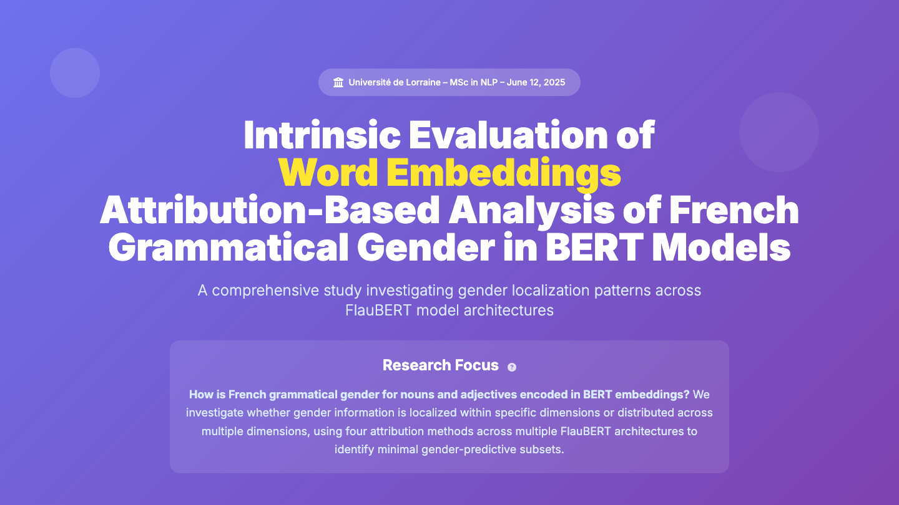

# Intrinsic Evaluation of Word Embeddings
## Attribution-Based Analysis of French Grammatical Gender in BERT Models

[](https://idmc.univ-lorraine.fr/)
[](https://nlpm1.rf.gd/)
[](https://github.com)

> **Master's Research Project** - MSc in Natural Language Processing  
> Université de Lorraine, June 2025



A comprehensive investigation into how French grammatical gender is encoded in BERT embeddings, using four attribution methods across multiple FlauBERT architectures to identify minimal gender-predictive dimensional subsets.

---

## 🌐 Interactive Experiment Version
An interactive version of the full experimental framework, including visualizations and model comparison dashboards, is available at:  
👉 **[https://nlpm1.rf.gd](https://nlpm1.rf.gd)**

---

## 🎯 Research Overview

### Core Research Question
**How is French grammatical gender for nouns and adjectives encoded in BERT embeddings?**

We investigate whether gender information is:
- Localized within specific dimensions, or
- Distributed across multiple dimensions

Using systematic attribution analysis across FlauBERT model variants.

### Key Findings

- ✅ **Distributed Encoding**: Gender forms a compact but redundant cluster, not singular "gender neurons"
- ✅ **Model Compression Potential**: 75% dimensional reduction with <5% accuracy loss
- ✅ **Architecture Efficiency**: FlauBERT-small-cased often outperforms larger variants
- ✅ **Task-Specific Performance**: French adjectives (96-99% accuracy) consistently outperform nouns (89-94%)
- ❌ **Universal Patterns**: No cross-model universal dimensional subset exists

---

## 📊 Experimental Results

### Performance Highlights

| Metric | Value | Configuration |
|--------|-------|--------------|
| **Best 1% Performance** | 85% | MLP, Large, RF, Adjectives |
| **Peak Accuracy** | 99% | Perceptron, Small, SHAP, Adjectives @25% |
| **Max Dimension Reduction** | 75% | With <5% accuracy loss |
| **Consensus Convergence** | 15/16 | Configurations at 5% threshold |

### Hypothesis Evaluation

| Hypothesis | Status | Evidence |
|------------|--------|----------|
| **H1: Within-Model Localization** | ✅ LARGELY SUPPORTED | 15/16 configurations converge at 5% |
| **H2: Cross-Model Universal Patterns** | ❌ REJECTED | No universal subset found |
| **H3: Minimal Dimensions Suffice** | ✅ STRONGLY SUPPORTED | 49-85% accuracy with 1% dimensions |

---

## 🏗️ Methodology

### FlauBERT Models Tested

- **flaubert-small-cased** (512 dimensions) - Best overall performer
- **flaubert-base-cased** (768 dimensions)
- **flaubert-base-uncased** (768 dimensions)
- **flaubert-large-cased** (1024 dimensions)

### Attribution Methods

1. **SHAP (Permutation)** - Game-theoretic Shapley values
2. **LIME (Tabular)** - Local interpretable model-agnostic explanations
3. **Random Forest (Gini)** - Feature importance via Gini impurity
4. **Ekaterina's Method** - Cross-validation based attribution

### Experimental Framework

**4 Experiments × 4 Models × 4 Attribution Methods = 64 Configurations**

1. **Experiment 1**: Perceptron + French Nouns
2. **Experiment 2**: Perceptron + French Adjectives
3. **Experiment 3**: MLP + French Nouns
4. **Experiment 4**: MLP + French Adjectives

### Dataset

- **Source**: Morphalou3 lexical resource
- **Samples**: ~33K total (16.5K nouns + 16.5K adjectives)
- **Distribution**: Balanced 50/50 feminine/masculine
- **Split**: Stratified 80/20 train-test

---

## 📈 Key Results

### Minimal Subset Performance

**FlauBERT-small-cased** (Best Overall):
- **1% dimensions**: 73% accuracy (Adjectives, EKA)
- **10% dimensions**: 96% accuracy (Adjectives, SHAP)
- **25% dimensions**: 99% accuracy (Adjectives, SHAP)

**FlauBERT-large-cased**:
- **1% dimensions**: 85% accuracy (Adjectives, RF)
- **10% dimensions**: 94% accuracy (Adjectives, RF)
- **25% dimensions**: 94% accuracy (Adjectives, SHAP/RF)

### Consensus Analysis

**Critical Finding**: No single reliable "gender neuron" exists. Gender information is distributed across multiple correlated dimensions, requiring consensus analysis to identify stable predictive cores.

**Consensus Convergence**:
- **1% threshold**: 0-2 dimensions (triple agreement across methods)
- **5% threshold**: 3-13 dimensions (15/16 configs achieve convergence)
- **10-25% threshold**: Stable consensus core emerges with strong inter-method agreement

### Model Comparison

| Model | Embedding Dims | Best 1% Acc | Best 25% Acc | Optimal Method |
|-------|---------------|-------------|--------------|----------------|
| Small-cased | 512 | 78% | 99% | SHAP/EKA |
| Base-cased | 768 | 66% | 79% | SHAP |
| Base-uncased | 768 | 62% | 65% | RF/SHAP |
| Large-cased | 1024 | 85% | 97% | RF/SHAP |

---

## 💡 Research Contributions

### Theoretical Impact

1. **Distributed vs. Localized Encoding**: Confirms gender information follows distributed representation patterns rather than localized "neuron" encoding
2. **Model-Specific Patterns**: Demonstrates that gender encoding strategies are architecture-dependent, rejecting universal localization hypothesis
3. **Consensus Core Discovery**: Identifies stable dimensional subsets through multi-method agreement at 10-25% thresholds
4. **Morphological Superiority**: Establishes that richer morphological markers in adjectives enable superior gender prediction

### Practical Applications

- 🔧 **Model Compression**: Deploy 75% smaller models for mobile/edge computing
- 🎯 **Bias Detection**: Use consensus cores for systematic fairness auditing
- 📊 **Interpretability Tools**: Build explainability frameworks for grammatical features
- 🌍 **Cross-Linguistic Research**: Extend methodology to other gendered languages

---

## 🎓 Research Team

### Supervisors
- **Prof. David Langlois** - Project Supervisor  
  📧 david.langlois@univ-lorraine.fr
- **Franco Terranova** - Project Reviewer  
  📧 franco.terranova@univ-lorraine.fr

### Students
- **Muhammad Tayyab** - [mdtayyab.com](https://mdtayyab.com) - muhammad.tayyab5@etu.univ-lorraine.fr
- **Celine Zyna-Rahme** - celine.zyna-rahme6@etu.univ-lorraine.fr
- **Chenhan Gao** - chenhan.gao5@etu.univ-lorraine.fr
- **Stephanie Ounanian** - stephanie.ounanian3@etu.univ-lorraine.fr

---

## 📚 Key References

### Methodology
- **Belinkov & Glass (2019)**: *Analysis Methods in Neural Language Processing: A Survey*
- **Lundberg & Lee (2017)**: *A Unified Approach to Interpreting Model Predictions* (SHAP)
- **Ribeiro et al. (2016)**: *"Why Should I Trust You?": Explaining Predictions* (LIME)
- **Conneau et al. (2018)**: *What you can cram into a single $&!#* vector*

### FlauBERT Models
- **Le et al. (2020)**: *FlauBERT: Unsupervised Language Model Pre-training for French*
- HuggingFace: [flaubert/flaubert_base_cased](https://huggingface.co/flaubert)

### Related Work
- **Goliakova & Langlois (2024)**: *French BERT Gender Analysis*

---

## 🔮 Future Research Directions

- [ ] **Cross-Linguistic Extension**: Apply to Spanish, German, Italian, Russian
- [ ] **Additional Grammatical Features**: Number, tense, aspect, case
- [ ] **Layer-Specific Analysis**: Probe individual BERT layers for localization
- [ ] **Attention Mechanism Study**: Correlate with attention weights
- [ ] **Downstream Tasks**: Evaluate compressed models on real NLU tasks
- [ ] **Training Dynamics**: Track gender encoding across training checkpoints

---

## 🏆 Research Impact

### Academic Contributions
- Advances interpretability research in neural language models
- Provides methodology for systematic feature localization analysis
- Challenges traditional "neuron-level" interpretability assumptions

### Practical Benefits
- **4× Model Compression**: Achieve 75% size reduction with minimal accuracy loss
- **Efficiency Gains**: Small models often outperform large ones for specific tasks
- **Bias Detection**: Framework applicable to fairness and bias analysis

### Industry Applications
- Mobile NLP deployment with compressed models
- Edge computing for resource-constrained devices
- Interpretable AI systems for regulated industries

---

## 📄 Copyright & Usage

© 2025 Muhammad Tayyab, Celine Zyna-Rahme, Chenhan Gao, Stephanie Ounanian. All rights reserved.

This is private academic research. Code and materials are not available for public use or distribution without explicit permission from the authors and Université de Lorraine.

---

## 🙏 Acknowledgements

- **Morphalou3 Dataset** - CNRTL (Centre National de Ressources Textuelles et Lexicales)
- **FlauBERT Team** - Pre-trained French BERT models
- **LORIA Laboratory** - Research infrastructure and support
- **Prof. Maxime Amblard** - Academic guidance
- **Université de Lorraine** - MSc in NLP Program

---

## 📞 Contact

**Muhammad Tayyab**  
🌐 [mdtayyab.com](https://mdtayyab.com)  
📧 muhammad.tayyab5@etu.univ-lorraine.fr

**Academic Supervisor**  
Prof. David Langlois - david.langlois@univ-lorraine.fr

---

## 📊 Citation

If you reference this work, please cite:

```bibtex
@mastersthesis{tayyab2025flaubert,
  title={Intrinsic Evaluation of Word Embeddings: Attribution-Based Analysis of French Grammatical Gender in BERT Models},
  author={Tayyab, Muhammad and Zyna-Rahme, Celine and Gao, Chenhan and Ounanian, Stephanie},
  year={2025},
  school={Université de Lorraine},
  type={Master's Supervised Project},
  note={MSc in Natural Language Processing},
  url={https://nlpm1.rf.gd}
}
```

---

## 📌 Project Status

> **Note**: This repository contains documentation for a supervised Master's thesis project.  
> Code and datasets are currently private as part of ongoing academic work.  
> For collaboration or access inquiries, please contact the research team.

---

**Last Updated**: October 2025  
**Status**: Master's Thesis Research Project  
**Institution**: Université de Lorraine, MSc in NLP

---

*This research advances the understanding of how linguistic features are encoded in neural language models, with implications for model interpretability, compression, and bias detection.*
